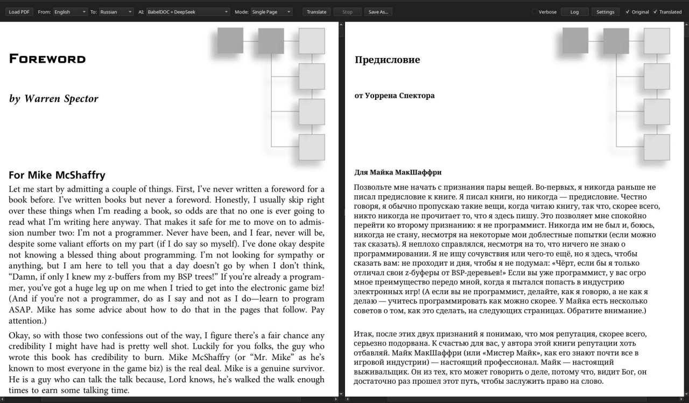

# Speculum

<p align="center">
  
</p>

<p align="center">
  A desktop PDF reader for reading the original and translated document side by side.
</p>

## Features

- Read the original and translated PDF in parallel
- Keep both views synchronized while scrolling and navigating
- Translate only the page you need, instead of processing the whole file every time
- Use focused reading modes depending on how you work
- Manage provider API keys directly from the app
- Run as a Linux desktop app through `AppImage`

## Translation Modes

### `Single Page`

Translate only the page you are currently viewing.

### `Window ±1`

Translate the previous page, current page, and next page together.

Useful when surrounding context matters.

### `Tracking Mode`

Translate new pages as you read through the document.

Use `Stop` to disable tracking.

## Providers

- `BabelDOC + DeepSeek`
- `BabelDOC + OpenAI`
- `DeepSeek (Legacy Overlay)`
- `Anthropic Claude (Legacy Overlay)`

## Download

Download the latest `AppImage` from [Releases](https://github.com/Zer0C00I/Speculum/releases).

```bash
chmod +x Speculum-x86_64.AppImage
./Speculum-x86_64.AppImage
```

## First Run

1. Open `Options` -> `API Keys...`
2. Enter your provider key
3. Load a PDF
4. Choose source language, target language, provider, and mode
5. Press `Translate`

## Preview

<p align="center">
  
</p>

## Local Run

Python `3.12` is recommended.

Using `pyenv`:

```bash
PYENV_VERSION=3.12.9 pyenv exec python -m venv .venv
.venv/bin/python -m pip install --upgrade pip
.venv/bin/python -m pip install -e .
./run_pyenv.sh
```

Or directly:

```bash
.venv/bin/python -m pdftranslator.main
```

## Configuration

Speculum follows XDG directories.

Default paths:

- config: `~/.config/pdftranslator/config.env`
- state: `~/.local/state/pdftranslator`
- cache: `~/.cache/pdftranslator`

The API keys dialog writes to:

```bash
~/.config/pdftranslator/config.env
```

Useful environment keys:

- `DEEPSEEK_API_KEY`
- `OPENAI_API_KEY`
- `OPENAI_BASE_URL`
- `OPENAI_MODEL`
- `ANTHROPIC_API_KEY`
- `DEFAULT_PROVIDER`
- `VERBOSE_LOGGING`
- `SAVE_LOGS_TO_FILE`
- `SAVE_SESSION_COPIES`

## Notes

- `Verbose Logging` changes log verbosity only
- `Save Logs To File` is off by default
- `Save Session Copies` is off by default
- the project is currently Linux-first

## License

See [LICENSE](LICENSE).
